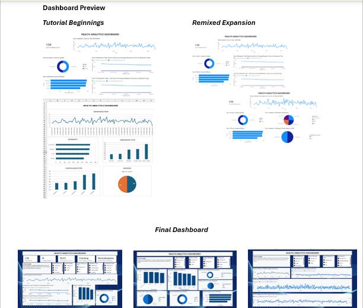

# Behavioral Health Analytics Dashboard

**SQL Server | Power BI | DAX | Healthcare Analytics**

Healthcare analytics project exploring an OCD patient dataset through SQL analysis, Power BI dashboard development, and healthcare-focused data interpretation.

---
## Table of Contents

- [Project Overview](#project-overview)
- [Objectives](#objectives)
- [Tools & Technologies](#tools--technologies)
- [Skills Demonstrated](#skills-demonstrated)
- [Repository Structure](#repository-structure)
- [Dashboard Preview](#dashboard-preview)
- [How to Use This Repository](#how-to-use-this-repository)
- [Key Takeaways](#key-takeaways)

## Project Overview

This project analyzes a cross-sectional dataset of 1,500 OCD patient records to explore demographic characteristics, symptom severity, medication usage, family history, previous diagnoses, and diagnosis-related patterns.

Originally created as a Power BI learning project, the dashboard evolved into a broader healthcare analytics portfolio project focused on data exploration, dashboard development, documentation, and analytical storytelling.

Throughout the project I used SQL Server, Power BI, DAX, Excel, and healthcare analytics concepts to better understand how descriptive patient data can support clinical decision-making and healthcare reporting.

---

## Objectives

- Explore patient demographic characteristics
- Analyze OCD symptom severity
- Examine medication distributions
- Investigate diagnosis-related patterns
- Build an interactive healthcare dashboard
- Document the complete analytics workflow

---

## Tools & Technologies

- SQL Server
- MySQL
- SQL Server Management Studio (SSMS)
- Power BI
- DAX
- Microsoft Excel

---

## Skills Demonstrated

- SQL Query Development
- Data Exploration
- Data Modeling
- Power BI Dashboard Development
- DAX Measures
- Interactive Reporting
- Healthcare Analytics
- Dashboard Storytelling
- Data Documentation

---

## Repository Structure

| Folder | Purpose |
|---------|----------|
| dashboard/ | Final Power BI dashboard (.pbix) |
| data/ | Original dataset and data dictionary |
| images/ | Dashboard evolution and dashboard screenshots |
| report/ | Detailed project report and methodology |
| sql/ | SQL queries used throughout the project |

---

## Dashboard Preview

## Dashboard Evolution

### Project Evolution

---

## Final Dashboard

### Page 1 — Patient Overview

---

### Page 2 — Clinical & Intervention Insights

---

### Page 3 — Diagnosis & Symptom Patterns

---

## Key Takeaways

This project expanded beyond dashboard creation into healthcare analytics, emphasizing data exploration, documentation, visualization, and the importance of understanding the analytical context behind healthcare datasets.

## How to Use This Repository

This repository contains the complete project workflow, from the original dataset through dashboard development and documentation.

### Dashboard

Navigate to the **dashboard/** folder and download the Power BI (.pbix) file to explore the interactive dashboard using Power BI Desktop.

### Data

The **data/** folder contains:

- Original OCD patient dataset (.csv)
- Data dictionary describing each field, dashboard metrics, and dataset structure

### SQL

The **sql/** folder contains SQL queries used during data exploration and dashboard development.

During development, I learned that Power BI visual interactivity is best supported by connecting visualizations to a shared data model rather than importing separate SQL query outputs. This led to redesigning the dashboard to use a single connected dataset, improving filtering and cross-visual interactions.

### Images

The **images/** folder documents the project's evolution and includes:

- Tutorial dashboard beginnings
- Expanded dashboard iteration
- Final dashboard pages
- Dashboard evolution overview

### Report

The **report/** folder contains a detailed project report describing the project objectives, methodology, dashboard structure, healthcare analytics concepts, and key learnings.

