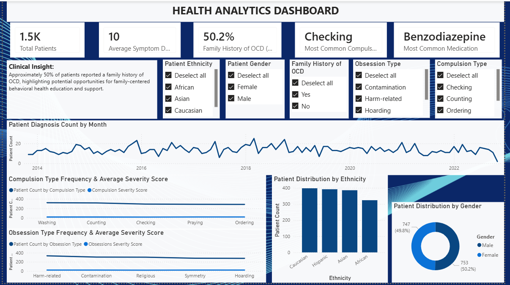
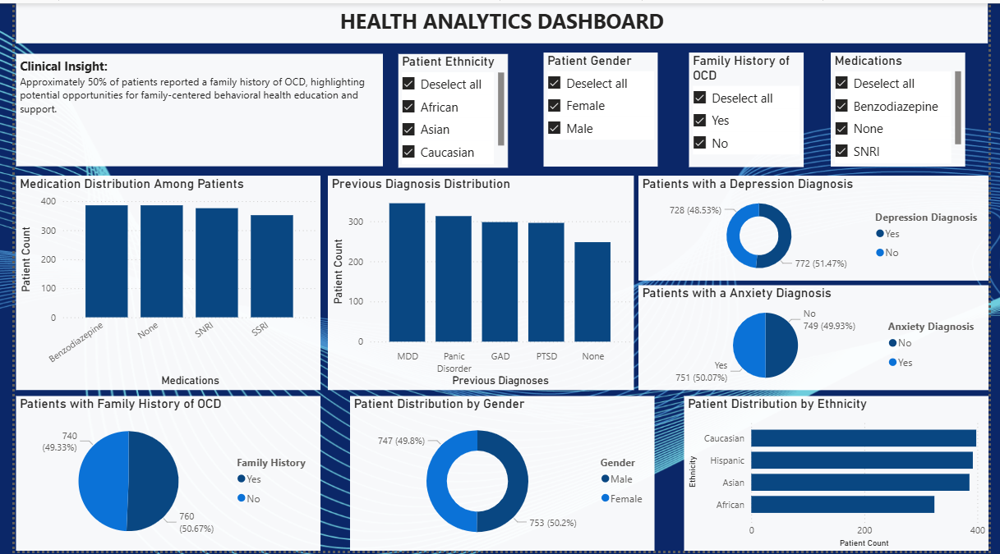
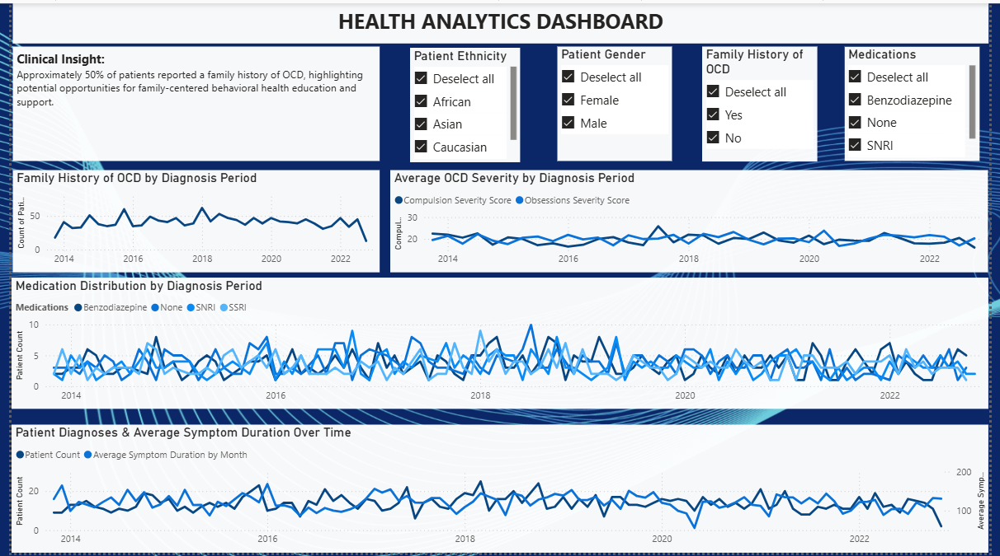

# Behavioral Health Analytics Dashboard: OCD Patient Insights

**SQL Server | Power BI | DAX | Healthcare Analytics**

---

## Table of Contents

- [Overview](#overview)
- [Potential Care Recommendations (Exploratory)](#potential-care-recommendations-exploratory)
- [Business & Healthcare System Insights](#business--healthcare-system-insights)
- [Tools Used](#tools-used)
- [Dashboard Structure](#dashboard-structure)
- [Page 1: Patient Overview](#page-1-patient-overview)
- [Page 2: Clinical & Intervention Insights](#page-2-clinical--intervention-insights)
- [Page 3: Diagnosis & Symptom Patterns](#page-3-diagnosis--symptom-patterns)
- [Skills Demonstrated](#skills-demonstrated)
- [Key Takeaways](#key-takeaways)

# Overview

## What Did I Build?

I built an OCD Patient Demographic and Healthcare Analytics Dashboard using a cross-sectional patient dataset, SQL Server, Power BI, and DAX to explore patient demographics, symptom severity, medications, family history, previous diagnoses, and diagnosis-related patterns.

What began as a project to learn Power BI dashboard development gradually expanded into a broader exploration of healthcare analytics, data modeling, reporting, and dashboard design. Throughout the project, I worked with MySQL, SQL Server Management Studio (SSMS), Power BI, Excel, and DAX to connect data sources, create measures, build KPIs, and develop interactive dashboard experiences.

The original goal of the project was to better understand Power BI, SQL, Excel integrations, and dashboard development. As I spent more time working with the dataset, however, I found myself asking additional questions about the patient population, healthcare decision-making, and how behavioral health organizations might use data to better understand and support patients.

Along the way, I learned about different healthcare analytics concepts and approaches, including longitudinal studies, which examine patient data over time, and cross-sectional studies, which provide a snapshot of a population at a specific point in time. Through discussions, analysis, and reviewing the dataset structure, I confirmed that the dataset being analyzed was cross-sectional. This clarification helped ensure that dashboard interpretations accurately reflected diagnosis-period patterns and patient characteristics rather than longitudinal patient progression.

The goal of this project evolved beyond building a dashboard. It became an opportunity to explore how healthcare organizations, behavioral health teams, and care coordinators might use patient data to better understand patient populations, identify patterns, support decision-making, and explore opportunities for personalized care planning.

---

# Potential Care Recommendations (Exploratory)

Based on dashboard observations, potential areas healthcare teams may explore include:

## Patient Intake & Assessment

* OCD symptom questionnaires to better understand ongoing severity, triggers, and support needs
* Family support intake questions to identify caregiver challenges or education needs
* Screening for co-occurring behavioral health concerns

## Education & Clinical Support

* Psychoeducational resources explaining OCD symptoms and treatment pathways
* Information about evidence-based interventions such as CBT or DBT
* Optional referrals to counseling, therapy, or support groups

## Care Coordination

* Case management support to improve continuity of care
* Family-centered support strategies to improve communication and reduce barriers to care
* Referral pathways between counseling, psychiatry, and community support services

## Community & Family Support

* Family support groups
* Peer support opportunities
* Educational resources for neurodiverse households

---

# Business & Healthcare System Insights

Potential system-level observations that healthcare organizations, insurers, or behavioral health providers may explore include:

## Care Access & Insurance Coverage

* Opportunities to evaluate whether behavioral health services (therapy, counseling, CBT/DBT, psychiatric support, family counseling) are sufficiently covered through insurance plans
* Potential barriers to care caused by provider availability, insurance network participation, or reimbursement limitations
* Identification of opportunities for greater provider enrollment within insurance networks to improve patient access

## Patient Education & Advocacy

* Increased patient education around OCD symptoms, treatment pathways, and available behavioral health resources
* Opportunities for patient advocacy programs to help individuals navigate treatment, insurance, and support systems
* Case management or care coordination pathways to improve continuity of care and reduce treatment barriers

## Family & Caregiver Support

* Support resources for caregivers and family systems affected by OCD-related challenges
* Education to improve understanding of neurodiverse or mental health household dynamics
* Referral opportunities for counseling, peer support, or family-focused interventions

---

# Tools Used

* MySQL
* SQL Server (SSMS)
* Power BI
* DAX
* Excel

### Project Applications

* Data exploration and querying
* Dashboard development and interactivity
* KPI creation and calculated measures
* Data modeling and reporting

---

# Dashboard Structure

The final dashboard was organized into three pages designed to move from a high-level patient overview to deeper clinical and diagnosis-related insights.

---

## Page 1: Patient Overview

The first page provides a high-level overview of the patient population and key OCD-related characteristics.

### Visuals Included

* Diagnosis distribution
* Gender distribution
* Comorbidity distribution
* Obsession and compulsion categories
* Severity score breakdowns
* Patient counts across categories

### Purpose

Provide stakeholders with a quick understanding of the patient population and identify patterns that may warrant further exploration.

---

## Page 2: Clinical & Intervention Insights

The second page expands the patient profile by examining additional clinical and demographic characteristics.

### Visuals Included

* Comorbid conditions occurring alongside OCD
* Medication distributions
* Previous diagnoses
* Depression and anxiety indicators
* Family history of OCD
* Gender and ethnicity breakdowns

### Purpose

Explore a more holistic view of the patient population and consider how healthcare providers, behavioral health teams, care coordinators, and support systems may better understand patient needs.

### Potential Areas for Exploration

* Patient intake and assessment practices
* Family and caregiver support needs
* Behavioral health education opportunities
* Care coordination strategies
* Community and support service referrals

These observations are exploratory in nature and intended to demonstrate how healthcare organizations might use descriptive patient data to inform discussions around patient support and care planning.

---

## Page 3: Diagnosis & Symptom Patterns

The third page focuses on diagnosis-related and symptom-related patterns within the dataset.

### Visuals Included

* Obsession and compulsion categories
* Severity score comparisons
* Medication distributions by diagnosis period
* Patient counts by diagnosis period
* Symptom duration analysis

### Purpose

This page became an important learning experience in understanding different healthcare analytics approaches, including longitudinal and cross-sectional analysis.

As I learned more about these concepts and reviewed the dataset structure, I confirmed that the data represented a cross-sectional snapshot of patients rather than patient progression over time.

As a result, visualizations and interpretations were designed to reflect diagnosis-period patterns, symptom characteristics, and patient demographics within the dataset. This reinforced the importance of understanding both the analytical approach and the underlying data structure before drawing conclusions from visualizations.

---

# Skills Demonstrated

### Data & Database Skills

* MySQL
* SQL Server
* Data Exploration
* Data Modeling
* Data Relationships

### Analytics & Visualization

* Power BI Dashboard Development
* DAX Measures and KPIs
* Interactive Reporting
* Dashboard Storytelling
* Data Visualization

### Healthcare Analytics

* Healthcare Data Interpretation
* Patient Demographic Analysis
* Behavioral Health Analytics
* Descriptive Analytics
* Cross-Sectional Data Analysis

---

# Key Takeaways

This project evolved from a Power BI learning exercise into a broader healthcare analytics project focused on understanding patient populations and communicating insights through data visualization.

Through the use of SQL, Power BI, DAX, and healthcare-focused analysis, I strengthened my skills in data modeling, dashboard development, healthcare data interpretation, and analytical storytelling while gaining a deeper appreciation for the importance of understanding both the data structure and the analytical approach behind healthcare reporting.
